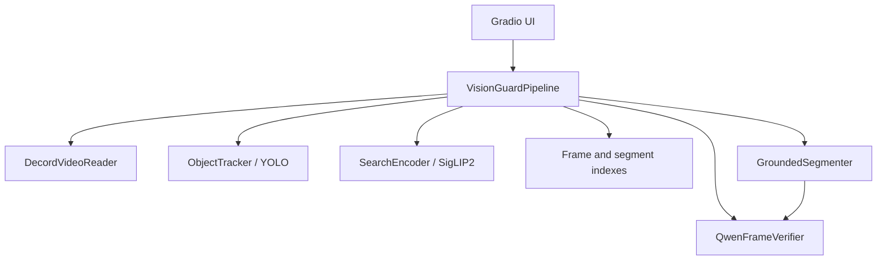
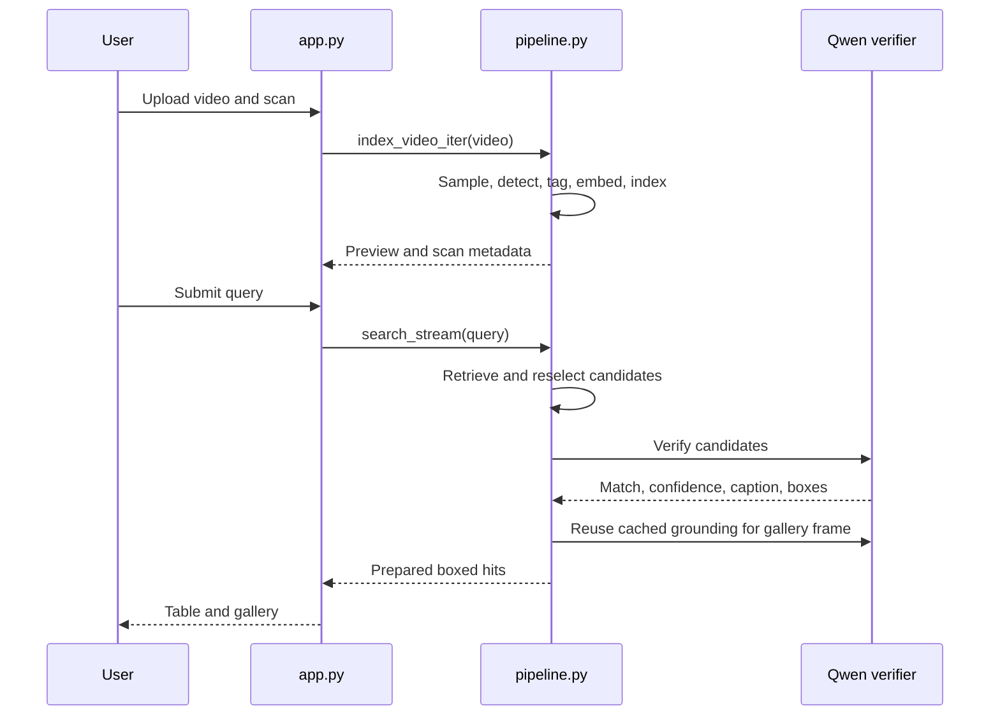

# Vision Guard Technical Documentation

## 1. Purpose

Vision Guard indexes CCTV video once and retrieves relevant frames from natural-language queries. The user workflow is scan a video, enter a query, and inspect verified boxed frames in the gallery. The application has no user-facing export feature.

## 2. Architecture



`GroundedSegmenter` is now a lightweight grounding adapter. It asks the existing verifier for query boxes and falls back to detector boxes when grounding returns none. It does not load SAM2 or create clips.

## 3. Application flow



## 4. Indexing

`VisionGuardPipeline.index_video_iter(video, sample_sec=0.75, win_sec=4.5)`:

1. Creates a timestamped run directory.
2. Samples frames through `DecordVideoReader`.
3. Rejects low-information or near-duplicate frames.
4. Runs YOLO batch detection on kept frames.
5. Adds object labels, detections, motion values, vehicle color tags, and appearance tags.
6. Writes frame JPEGs while SigLIP2 embeds the pending batch.
7. Builds frame and segment vector indexes.
8. Writes internal index artifacts in `reports/`.

Indexing does not run Qwen verification or grounding. Removing user exports did not change the sampling, detection, embedding, or index-build path.

## 5. Query retrieval

`_candidate_hits()` performs retrieval in this order:

1. Detector-first retrieval for supported object and color queries.
2. Frame ANN retrieval using a SigLIP2 text embedding.
3. Object fallback retrieval.
4. Low-confidence frame clustering for non-strict queries.
5. Segment ANN retrieval.

Top candidates are densely reselected from the original video before verification. Simple supported object queries verify a smaller shortlist. Detailed or event-style queries verify up to eight candidates through the existing shared worker pool. This increases recall for detailed queries without modifying indexing work.

Vehicle color metadata applies only to vehicle object classes. Clothing-color phrases such as `person wearing yellow jacket` remain semantic queries rather than being rejected because people do not have vehicle paint tags.

Unsupported simple object labels remain conservative: `taxi` is not silently treated as `car`.

## 6. Color retrieval

`_estimate_color()` only analyzes the central 45% of a detected vehicle bounding box. The central crop reduces contamination from asphalt, surrounding traffic, shadows, and detector-box background. HSV saturation, brightness, and hue ratios determine the available color tags.

This is a heuristic, not a paint-classification model. Strong reflections, partial occlusion, night footage, and inaccurate detector boxes can still reduce color accuracy.

## 7. Verification and gallery boxing

`QwenFrameVerifier.verify_query()` evaluates the full query conservatively. A verified match requires both a positive match decision and at least one cleaned box. The verifier caches results by normalized query plus frame key or path.

`prepare_hits()` creates gallery rows. For every hit, `_attach_gallery_frame()` calls `GroundedSegmenter.detect()` with the frame key. This reuses cached verifier output where available, draws the returned boxes with OpenCV, and writes a `boxed_match_*.jpg` image to `segments/`.

Gallery box states are explicit:

- `grounded`: Qwen verified and localized the submitted query.
- `detector`: a supported object/color detector fallback box is shown because Qwen did not localize the query.
- `none`: no localizable box is available, so the raw representative frame is shown.

## 8. User interface

`app.py` exposes:

- video input
- scan button and live preview
- natural-language query input
- result summary and result table
- boxed-frame gallery

It does not expose clip, HTML, CSV, JSON, ZIP, or report download controls.

## 9. Internal artifacts

Each run contains `frames/`, `segments/`, and `reports/`.

`reports/` is an internal storage location for the vector-index files and `index.json` metadata created during indexing. It is not an export feature and has no UI download action.

## 10. Runtime requirements

Install [requirements.txt](requirements.txt), then run:

```bash
python app.py
```

The active environment must include OpenCV because the pipeline reads images and draws bounding boxes with it. CUDA availability changes model execution behavior. Windows CPU development uses the verifier's `dev_passthrough` backend, which returns no verified match and no Qwen box; this is not fidelity-preserving inference.

## 11. Configuration

`settings.py` centralizes operational defaults and reads environment overrides at process start. It validates positive integer and non-negative float settings, falling back to the default on invalid input.

The configurable values cover model identifiers, YOLO confidence/image size, worker count, vector-index bit width, sample/window duration, query result count, gallery columns, and verification timeout. The Gradio host and sharing options remain controlled by `VISION_GUARD_HOST` and `GRADIO_SHARE` in `app.py`.

## 12. Constraints

- Result quality depends on sampled-frame visibility, detector quality, embedding relevance, and verifier accuracy.
- The verifier is invoked only after retrieval narrows the candidate set; it is not an exhaustive video scan.
- On Windows CPU development mode, Qwen is unavailable. The search path returns low-confidence semantic candidates with an explicit unverified status instead of returning an empty result or claiming verification.
- Detailed-query verification can take longer than simple object retrieval because it examines more candidates.
- A gallery box proves that a grounding result or detector fallback was available; it is not a guarantee of real-world identity or event truth.

## 13. Review questions and answers

### Why build both frame and segment indexes?

Frame indexes support precise visual matches. Segment indexes provide a broader temporal representation when a single sampled frame is weak. Using both gives retrieval two granularities.

### Why use detector-first retrieval when semantic retrieval exists?

For supported object and color queries, stored YOLO metadata is a fast exact-class filter. Semantic retrieval remains useful for detail that the detector does not encode.

### What does dense frame reselection solve?

It replaces a coarse sampled representative with the most query-relevant frame found inside the selected time window.

### Why verify after ANN narrowing?

Qwen verification is more expensive than vector search. ANN retrieval narrows the number of frames that require visual reasoning.

### Why reject unsupported simple object labels conservatively?

Treating an unsupported label as a nearby supported class can create misleading matches. The code avoids that substitution.

### Are event queries disabled?

No. Event-style queries now continue into semantic retrieval and Qwen verification. Their accuracy depends on whether the event is visibly represented in the candidate frames.

### How does vehicle color work?

The pipeline analyzes the center 45% of a YOLO vehicle box in HSV space and stores a color tag when its heuristic thresholds are met.

### Why can supported object queries return a result without verifier confirmation?

The pipeline allows trusted detector/object-fallback rows for supported object queries when no verified row is available. This preserves useful object retrieval while marking weaker evidence through the result flow.

### Does the project create segmented clips or reports?

No. User-facing clip generation, SAM2 segmentation, and HTML, CSV, JSON, ZIP, and report exports were removed.

### Why does the verifier cache include the frame key and query?

The same frame can be used in retrieval, verification, and gallery boxing. The key prevents repeated model work for the same normalized query and frame.

### Why is the shared thread pool configurable?

The code uses `cfg.index_workers` workers for JPEG writes and query verification. The default is four workers, which bounds concurrent CPU/GPU-adjacent work without hard-coding the value.

### Does removing exports affect indexing speed?

No indexing stage depends on user export code. Sampling, detection, embedding, and index construction remain in the scan path.

### What does a boxed gallery image mean?

It shows a verifier-grounded box when Qwen localized the submitted query, a clearly labeled detector fallback for supported object/color queries, or no box when neither is available. It helps visual review but is not a guarantee beyond the model evidence.

### Can the project be declared end-to-end verified here?

No. Source compilation and static callback checks can be run without full dependencies, but an end-to-end run requires an environment with the declared runtime packages and compatible model resources.

## 14. Source-file reference

### `app.py`

Builds the Gradio Blocks UI and owns UI event wiring. `_in_colab`, `_server_name`, and `_share_enabled` derive launch behavior. `_sample_videos` lists bundled MP4 examples. `_meta`, `_ans`, `_gallery`, and `_find_payload` transform pipeline dictionaries into Gradio values. `scan_only` streams five scan outputs (`status`, `live`, `info`, `query`, and `find_btn`). `find_query` streams six search outputs. `get_system_status` returns the warmup status. The module creates `VisionGuardPipeline`, starts its background warmup thread, and launches only when run as the main module.

### `settings.py`

Provides `cfg`, the process-start configuration object. `_text`, `_int`, and `_float` read environment values and reject empty, non-numeric, or out-of-range numeric input by returning their defaults. `Settings` contains model paths, scan and retrieval limits, index options, and UI limits. Configuration is not reloaded while the process is running.

### `cache_utils.py`

Reads any supported Hugging Face token environment variable and configures persistent cache locations only when the Colab Drive directory exists. Its Hugging Face login failure is intentionally non-fatal, so local execution without a token can continue.

### `pipeline.py`

`VisionGuardPipeline` orchestrates the application. `_estimate_color` creates vehicle appearance tags. `_new_run` creates a timestamped output directory and avoids reusing an existing path. `_is_interesting_frame`, `_is_non_content_frame`, and signature helpers reduce duplicate/empty indexing work. `_candidate_hits` ranks detector, frame, fallback, weak-frame, and segment candidates. `_reselect_best_frame` chooses a better representative inside a hit window. `_verify_rows` and `_verify_rows_stream` apply Qwen verification. `_attach_gallery_frame` renders grounded or detector-fallback boxes. `index_video_iter` builds in-memory frame and segment indexes and writes internal artifacts. `search_stream` and `search` return confirmed rows, with detector fallback for supported object queries. `prepare_hits` formats gallery-ready rows.

### `tracker.py`

`ObjectTracker` wraps Ultralytics YOLO. `load` selects the configured model and device. `class_ids` and `names` expose model classes. `track`, `detect`, and `detect_batch` normalize YOLO outputs into dictionaries containing `box`, `conf`, `cls`, and `name`. The current indexing path uses `detect_batch`; tracked IDs are not populated into indexed frame metadata.

### `vlm.py`

`SearchEncoder` loads the configured SigLIP2-compatible Transformers model and processor. `embed_text`, `embed_frame`, and `embed_frames` return L2-normalized `float32` vectors. CUDA batches use mixed precision; CPU uses normal no-grad inference.

### `qwen_verifier.py`

`QwenFrameVerifier` selects vLLM on CUDA when available, otherwise the Transformers backend. On Windows without CUDA it uses a non-fidelity development passthrough that returns no verified match or box. `_clean_boxes` accepts normalized, pixel, and 0–1000 box coordinates, clamps them to image bounds, and drops invalid boxes. `verify_query` requests a JSON decision, applies confidence thresholds, caches by normalized query plus frame identity, and returns `matched`, `confidence`, `caption`, and `boxes`. `ground_phrase` returns only boxes from a verified result.

### `segmenter.py`

`GroundedSegmenter.detect` delegates grounding to `QwenFrameVerifier` and returns verifier boxes or supplied detector fallback boxes, plus a boolean stating whether the boxes were grounded.

### `vector_index.py`

`SegmentVectorIndex` validates 2-D vectors and aligned IDs. It uses turbovec when available and falls back to exact NumPy dot-product search. `build_merged` combines scan chunks before building.

### `video_reader.py`

`DecordVideoReader` prefers Decord and falls back to OpenCV. It validates frame indices, converts decoded RGB arrays to BGR for OpenCV consumers, and exposes frame batches and timestamps.

## 15. Models and dependency facts

| Component | Configured default | Code integration | Code-recorded rationale |
| --- | --- | --- | --- |
| Object detector | `yolo11m.pt` | `ObjectTracker` through Ultralytics YOLO | Used for class metadata, batch detection, the optional tracking API, and detector fallback boxes. |
| Image/text encoder | `google/siglip2-so400m-patch14-384` | `SearchEncoder` through Transformers | Produces normalized vectors for frame, segment, and text retrieval. |
| Visual verifier | `Qwen/Qwen2.5-VL-7B-Instruct-AWQ` | `QwenFrameVerifier` through vLLM or Transformers | Performs literal query confirmation and localization after candidate narrowing. |
| Vector backend | turbovec, NumPy fallback | `SegmentVectorIndex` | Uses turbovec when importable; keeps NumPy exact search available when it is not. |

The repository does not contain benchmark results or a recorded comparison against alternative model families. It therefore cannot support a factual claim that these defaults are universally more accurate than alternatives.

## 16. Data contracts

### Detection row

`{"box": [x1, y1, x2, y2], "conf": number, "cls": integer, "name": string, "color": string or null}` once the pipeline enriches vehicle detections. Boxes are pixel coordinates from YOLO and are rounded to two decimals.

### Frame row

Contains `frame_id`, `frame`, `ts`, `emb`, `frame_path`, and `meta` while indexing is in memory. The persisted/index metadata includes objects, appearances, detections, motion information, and an empty `tracks` list in the current scan path.

### Search hit

Contains `query`, `score`, `base_score`, `start`, `end`, `peak_ts`, frame paths, object metadata, summary text, and optional verifier fields. Gallery preparation adds `match_id`, `label`, `gallery_frame`, and `gallery_box_source` (`grounded`, `detector`, or `none`). `tracks` may be present but is empty in the current indexing path.

### Verifier response

`{"matched": boolean, "confidence": number from 0 to 1, "caption": string, "boxes": list}`. Invalid, inverted, or out-of-image boxes are removed before use.

## 17. Compatibility and troubleshooting

The requirements pin Gradio to `>=5,<6` and Transformers to `>=4.57,<5`. Restart the app after dependency changes so the runtime reloads the installed packages.

Hugging Face authentication warnings indicate reduced download rate limits; set `HF_TOKEN` to authenticate downloads. On Windows without CUDA, the verifier intentionally uses `dev_passthrough` instead of full Qwen inference.
