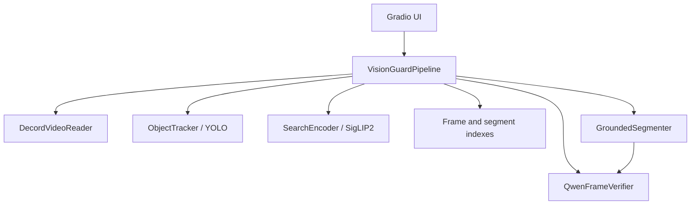
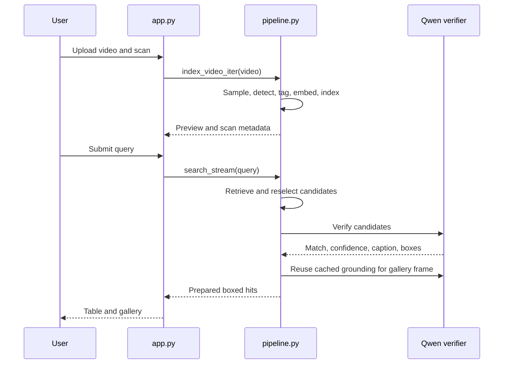

# Vision Guard Master Technical Reference

## 1. Purpose

Vision Guard indexes CCTV video once and retrieves relevant frames from natural-language queries. The user workflow is scan a video, enter a query, and inspect verified boxed frames in the gallery. The application has no user-facing export feature.

## 2. Architecture



`GroundedSegmenter` is now a lightweight grounding adapter. It asks the existing verifier for query boxes and falls back to detector boxes when grounding returns none. It does not load SAM2 or create clips.

## 3. Application flow



## 4. Indexing

`VisionGuardPipeline.index_video_iter(video, sample_sec=0.75, win_sec=4.5)`:

1. Creates a timestamped run directory.
2. Samples frames through `DecordVideoReader`.
3. Rejects low-information or near-duplicate frames.
4. Runs YOLO batch detection on kept frames.
5. Adds object labels, detections, motion values, vehicle color tags, and appearance tags.
6. Writes frame JPEGs while SigLIP2 embeds the pending batch.
7. Builds frame and segment vector indexes.
8. Writes internal index artifacts in `reports/`.

Indexing does not run Qwen verification or grounding. Removing user exports did not change the sampling, detection, embedding, or index-build path.

## 5. Query retrieval

`_candidate_hits()` performs retrieval in this order:

1. Detector-first retrieval for supported object and color queries.
2. Frame ANN retrieval using a SigLIP2 text embedding.
3. Object fallback retrieval.
4. Low-confidence frame clustering for non-strict queries.
5. Segment ANN retrieval.

Top candidates are densely reselected from the original video before verification. Strict object queries verify up to four candidates; detailed queries verify up to eight through the existing shared worker pool. Detailed detector queries retain a larger internal candidate pool before this step. This increases recall for detailed queries without modifying indexing work.

Vehicle color metadata applies only to vehicle object classes. Clothing-color phrases such as `person wearing yellow jacket` remain semantic queries rather than being rejected because people do not have vehicle paint tags.

Query parsing retains fixed natural-language aliases and also discovers literal class labels from the configured YOLO model. Unsupported simple labels remain conservative: `taxi` is not silently treated as `car`.

## 6. Color retrieval

`_estimate_color()` only analyzes the central 45% of a detected vehicle bounding box. The central crop reduces contamination from asphalt, surrounding traffic, shadows, and detector-box background. HSV saturation, brightness, and hue ratios determine the available color tags.

This is a heuristic, not a paint-classification model. Strong reflections, partial occlusion, night footage, and inaccurate detector boxes can still reduce color accuracy.

## 7. Verification and gallery boxing

`QwenFrameVerifier.verify_query()` evaluates the full query conservatively. A verified match requires both a positive match decision and at least one cleaned box. The verifier caches results by normalized query plus frame key or path.

`prepare_hits()` creates gallery rows. For every hit, `_attach_gallery_frame()` calls `GroundedSegmenter.detect()` with the frame key. This reuses cached verifier output where available, draws the returned boxes with OpenCV, and writes a `boxed_match_*.jpg` image to `segments/`.

Gallery box states are explicit:

- `grounded`: Qwen verified and localized the submitted query.
- `detector`: a supported object/color detector fallback box is shown because Qwen did not localize the query.
- `none`: no localizable box is available, so the raw representative frame is shown.

## 8. User interface

`app.py` exposes:

- video input
- scan button and live preview
- natural-language query input
- result summary and result table
- boxed-frame gallery

It does not expose clip, HTML, CSV, JSON, ZIP, or report download controls.

## 9. Internal artifacts

Each run contains `frames/`, `segments/`, and `reports/`.

`reports/` is an internal storage location for the vector-index files and `index.json` metadata created during indexing. It is not an export feature and has no UI download action.

## 10. Runtime requirements

Install [requirements.txt](requirements.txt), then run:

```bash
python app.py
```

The active environment must include OpenCV because the pipeline reads images and draws bounding boxes with it. CUDA availability changes model execution behavior. Windows CPU development uses the verifier's `dev_passthrough` backend, which returns no verified match and no Qwen box; this is not fidelity-preserving inference.

## 11. Configuration

`settings.py` centralizes operational defaults and reads environment overrides at process start. It validates positive integer and non-negative float settings, falling back to the default on invalid input.

The configurable values cover model identifiers, YOLO confidence/image size, worker count, vector-index bit width, sample/window duration, query result count, gallery columns, and verification timeout. The Gradio host and sharing options remain controlled by `VISION_GUARD_HOST` and `GRADIO_SHARE` in `app.py`.

## 12. Constraints

- Result quality depends on sampled-frame visibility, detector quality, embedding relevance, and verifier accuracy.
- The verifier is invoked only after retrieval narrows the candidate set; it is not an exhaustive video scan.
- On Windows CPU development mode, Qwen is unavailable. The search path returns low-confidence semantic candidates with an explicit unverified status instead of returning an empty result or claiming verification.
- Detailed-query verification can take longer than simple object retrieval because it examines more candidates.
- A gallery box proves that a grounding result or detector fallback was available; it is not a guarantee of real-world identity or truth.

## 13. Review questions and answers

### Why build both frame and segment indexes?

Frame indexes support precise visual matches. Segment indexes provide a broader temporal representation when a single sampled frame is weak. The current code creates one segment record per retained frame while aggregating an integer-sized frame block, so records within the same block repeat aggregate content with different IDs and representative frames.

### Why use detector-first retrieval when semantic retrieval exists?

For supported object and color queries, stored YOLO metadata is a fast exact-class filter. Semantic retrieval remains useful for detail that the detector does not encode.

### What does dense frame reselection solve?

It replaces a coarse sampled representative with the most query-relevant frame found inside the selected time window.

### Why verify after ANN narrowing?

Qwen verification is more expensive than vector search. ANN retrieval narrows the number of frames that require visual reasoning.

### Why reject unsupported simple object labels conservatively?

Treating an unsupported label as a nearby supported class can create misleading matches. The code avoids that substitution.

### How does vehicle color work?

The pipeline analyzes the center 45% of a YOLO vehicle box in HSV space and stores a color tag when its heuristic thresholds are met.

### Why can supported object queries return a result without verifier confirmation?

The pipeline allows trusted detector/object-fallback rows for supported object queries when no verified row is available. This preserves useful object retrieval while marking weaker evidence through the result flow.

### Does the project create segmented clips or reports?

No. User-facing clip generation, SAM2 segmentation, and HTML, CSV, JSON, ZIP, and report exports were removed.

### Why does the verifier cache include the frame key and query?

The same frame can be used in retrieval, verification, and gallery boxing. The key prevents repeated model work for the same normalized query and frame.

### Why is the shared thread pool configurable?

The code uses `cfg.index_workers` workers for JPEG writes and query verification. The default is four workers, which bounds concurrent CPU/GPU-adjacent work without hard-coding the value.

### Does removing exports affect indexing speed?

No indexing stage depends on user export code. Sampling, detection, embedding, and index construction remain in the scan path.

### What does a boxed gallery image mean?

It shows a verifier-grounded box when Qwen localized the submitted query, a clearly labeled detector fallback for supported object/color queries, or no box when neither is available. It helps visual review but is not a guarantee beyond the model evidence.

### Can the project be declared end-to-end verified here?

No. Source compilation and static callback checks can be run without full dependencies, but an end-to-end run requires an environment with the declared runtime packages and compatible model resources.

## 14. Source-file reference

### `app.py`

Builds the Gradio Blocks UI and owns UI event wiring. `_in_colab`, `_server_name`, and `_share_enabled` derive launch behavior. `_sample_videos` lists bundled MP4 examples. `_meta`, `_ans`, `_gallery`, and `_find_payload` transform pipeline dictionaries into Gradio values. `scan_only` streams five scan outputs (`status`, `live`, `info`, `query`, and `find_btn`). `find_query` streams six search outputs. `get_system_status` returns the warmup status. The module creates `VisionGuardPipeline`, starts its background warmup thread, and launches only when run as the main module.

### `settings.py`

Provides `cfg`, the process-start configuration object. `_text`, `_int`, and `_float` read environment values and reject empty, non-numeric, or out-of-range numeric input by returning their defaults. `Settings` contains model paths, scan and retrieval limits, index options, and UI limits. Configuration is not reloaded while the process is running.

### `cache_utils.py`

Reads any supported Hugging Face token environment variable and configures persistent cache locations only when the Colab Drive directory exists. Its Hugging Face login failure is intentionally non-fatal, so local execution without a token can continue.

### `pipeline.py`

`VisionGuardPipeline` orchestrates the application. `_estimate_color` creates vehicle appearance tags. `_new_run` creates a timestamped output directory and avoids reusing an existing path. `_is_interesting_frame`, `_is_non_content_frame`, and signature helpers reduce duplicate/empty indexing work. `_candidate_hits` ranks detector, frame, fallback, weak-frame, and segment candidates. `_reselect_best_frame` chooses a better representative inside a hit window. `_verify_rows` and `_verify_rows_stream` apply Qwen verification. `_attach_gallery_frame` renders grounded or detector-fallback boxes. `index_video_iter` builds in-memory frame and segment indexes and writes internal artifacts. `search_stream` and `search` return confirmed rows, with detector fallback for supported object queries. `prepare_hits` formats gallery-ready rows.

### `tracker.py`

`ObjectTracker` wraps Ultralytics YOLO. `load` selects the configured model and device. `class_ids` and `names` expose model classes. `track`, `detect`, and `detect_batch` normalize YOLO outputs into dictionaries containing `box`, `conf`, `cls`, and `name`. The current indexing path uses `detect_batch`; tracked IDs are not populated into indexed frame metadata.

### `vlm.py`

`SearchEncoder` loads the configured SigLIP2-compatible Transformers model and processor. `embed_text`, `embed_frame`, and `embed_frames` return L2-normalized `float32` vectors. CUDA batches use mixed precision; CPU uses normal no-grad inference.

### `qwen_verifier.py`

`QwenFrameVerifier` selects vLLM on CUDA when available, otherwise the Transformers backend. On Windows without CUDA it uses a non-fidelity development passthrough that returns no verified match or box. `_clean_boxes` accepts normalized, pixel, and 0–1000 box coordinates, clamps them to image bounds, and drops invalid boxes. `verify_query` requests a JSON decision, applies confidence thresholds, caches by normalized query plus frame identity, and returns `matched`, `confidence`, `caption`, and `boxes`. `ground_phrase` returns only boxes from a verified result.

### `segmenter.py`

`GroundedSegmenter.detect` delegates grounding to `QwenFrameVerifier` and returns verifier boxes or supplied detector fallback boxes, plus a boolean stating whether the boxes were grounded.

### `vector_index.py`

`SegmentVectorIndex` validates 2-D vectors and aligned IDs. It uses turbovec when available and falls back to exact NumPy dot-product search. `build_merged` combines scan chunks before building.

### `video_reader.py`

`DecordVideoReader` prefers Decord and falls back to OpenCV. It validates frame indices, converts decoded RGB arrays to BGR for OpenCV consumers, and exposes frame batches and timestamps.

## 15. Models and dependency facts

| Component | Configured default | Code integration | Code-recorded rationale |
| --- | --- | --- | --- |
| Object detector | `yolo11m.pt` | `ObjectTracker` through Ultralytics YOLO | Used for class metadata, batch detection, and detector fallback boxes. |
| Image/text encoder | `google/siglip2-so400m-patch14-384` | `SearchEncoder` through Transformers | Produces normalized vectors for frame, segment, and text retrieval. |
| Visual verifier | `Qwen/Qwen2.5-VL-7B-Instruct-AWQ` | `QwenFrameVerifier` through vLLM or Transformers | Performs literal query confirmation and localization after candidate narrowing. |
| Vector backend | turbovec, NumPy fallback | `SegmentVectorIndex` | Uses turbovec when importable; keeps NumPy exact search available when it is not. |

The repository does not contain benchmark results or a recorded comparison against alternative model families. It therefore cannot support a factual claim that these defaults are universally more accurate than alternatives.

## 16. Data contracts

### Detection row

`{"box": [x1, y1, x2, y2], "conf": number, "cls": integer, "name": string, "color": string or null}` once the pipeline enriches vehicle detections. Boxes are pixel coordinates from YOLO and are rounded to two decimals.

### Frame row

Contains `frame_id`, `frame`, `ts`, `emb`, `frame_path`, and `meta` while indexing is in memory. The persisted/index metadata includes objects, appearances, detections, motion information, and an empty `tracks` list in the current scan path.

### Search hit

Contains `query`, `score`, `base_score`, `start`, `end`, `peak_ts`, frame paths, object metadata, summary text, and optional verifier fields. Gallery preparation adds `match_id`, `label`, `gallery_frame`, and `gallery_box_source` (`grounded`, `detector`, or `none`). `tracks` may be present but is empty in the current indexing path.

### Verifier response

`{"matched": boolean, "confidence": number from 0 to 1, "caption": string, "boxes": list}`. Invalid, inverted, or out-of-image boxes are removed before use.

## 17. Compatibility and troubleshooting

The requirements pin Gradio to `>=5,<6` and Transformers to `>=4.57,<5`. Restart the app after dependency changes so the runtime reloads the installed packages.

Hugging Face authentication warnings indicate reduced download rate limits; set `HF_TOKEN` to authenticate downloads. On Windows without CUDA, the verifier intentionally uses `dev_passthrough` instead of full Qwen inference.

## 18. Code-Derived Execution Detail

### 18.1 Initialization and state ownership

`pipeline.py` calls `setup_cache()` at import. A `VisionGuardPipeline` instance owns `trk` (`ObjectTracker`), `enc` (`SearchEncoder`), `ver` (`QwenFrameVerifier`), `seg` (`GroundedSegmenter` sharing `ver`), `frame_idx`, `search_idx`, one `ThreadPoolExecutor`, `idx`, and `run_dir`. The executor worker count is `cfg.index_workers` and is shared by JPEG writes and query verifier calls.

`app.py` calls `setup_cache()` again, creates the module-global `pipe`, and starts `pipe.warmup_models()` in a daemon thread. Warmup separately calls tracker load, encoder load, and verifier warmup; exceptions are captured by component name and exposed by `get_system_status`. They do not stop module import or UI construction.

### 18.2 Exact indexing mechanics

`index_video_iter(video, sample_sec=None, win_sec=None)` creates a run path `<output>/<video-stem>_<timestamp-with-microseconds>`. If that path exists it adds an eight-character UUID suffix; it never removes a prior run.

Frame indices are `range(0, total_frames, max(1, round(sample_sec * fps)))`. Frames are read in batches of eight. A frame signature is grayscale, resized to `64 x 36`, and Gaussian blurred. The first sample is retained. Thereafter a sample is retained when normalized mean absolute signature difference is at least `0.025`, or when at least `4.0` seconds have elapsed since the last retained frame. A detection-free frame is further discarded only when grayscale mean is below 40, standard deviation below 28, and Canny edge fraction below 0.025.

YOLO inference receives only retained candidates through `detect_batch(..., conf=0.18)`. Each accepted detection gets a vehicle color tag only for `car`, `truck`, `bus`, `motorcycle`, and `bicycle`. Pending accepted frames flush at `SearchEncoder.image_batch_size`: JPEG writes are submitted to the shared executor while `embed_frames` runs; writes are awaited before frame rows and vector chunks are committed.

The frame index has one vector per retained frame. Segment construction is deliberately literal: the loop runs once per retained frame, calculates a block by integer-dividing the current position by `round(win_sec/sample_sec)`, and mean-pools that block. Consequently, frames in a block create duplicate aggregate segment vectors/statistics with distinct `seg_id`, `mid`, and representative path. `meta["segments"]` is therefore the retained-frame count, not a count of unique blocks.

`index.json` persists metadata, frame metadata, and segment metadata only; it does not persist embedding arrays. `meta.total_detections` is the sum of per-frame distinct object-label counts, rather than a count of all individual boxes.

### 18.3 Exact query mechanics

`_normalize_query` lowercases, trims, collapses spaces, and replaces: `peoples`/`persons` with `person`; `human beings` with `people`; `bikes` with `bicycle`; `cycles` with `bicycle`; `cars`, `trucks`, `buses`, and `umbrellas` with singular forms.

`_q_objs` combines fixed natural-language aliases with literal labels from `self.trk.names()`. It also creates naive singular forms for query words longer than three characters ending in `s`; a multiword detector label is included only when every label word occurs in the query word set. This enables labels exposed by the configured detector beyond the fixed alias map. `_is_strict_object_query` remains a fixed token allowlist, so dynamic labels can be detector-recognized yet treated as detailed/non-strict.

`_embed_query` embeds both the original lowercased query and normalized query when they differ, mean-pools their vectors, and L2-normalizes the mean. `_candidate_hits` executes detector refinement first, then frame-vector retrieval, object fallback, weak semantic frame candidates, and segment-vector retrieval. Later routes run only if prior routes did not return candidates.

| Route | Candidate condition and score |
| --- | --- |
| Detector | Matching requested classes/colors from stored detections; best confidence must be at least 0.2. Score is `0.44 + 0.32*best_conf + 0.05*(count-1, minimum 0)`. |
| Frame semantic | Top `min(max(top_k*12, 36), frame_count)` vector hits. Object intersections add 0.1 each, no intersection subtracts 0.08; matching vehicle appearance tags add 0.22 each, no color tag subtracts 0.12. Rows below 0.14 are removed. |
| Object fallback | Stored object/appearance metadata only. Score is `0.2 + 0.08*object_hits + 0.14*color_hits`; outputs are low confidence. |
| Weak semantic | Non-strict query only; clusters the highest ranked rows without the frame-score threshold and marks them low confidence. |
| Segment semantic | Top `min(max(top_k*8, 24), segment_count)` hits; object intersections add 0.12 each or subtract 0.1 when none; score must be at least 0.18. |

Temporal detector/frame spacing is `max(sample_sec*1.25, 1.0)`; object fallback spacing is two seconds; segment spacing is three seconds. Detailed queries use an internal detector candidate limit of `min(max(top_k*3, 8), max(8, frame_count))` and verify up to eight rows. Strict detector queries use `top_k` candidates and verify up to four.

### 18.4 Dense reselection, verification, and gallery

For at most four candidate hits, `_reselect_best_frame` rereads the original video, samples the hit window every approximately 0.1 seconds, reads chunks of 16, embeds each frame, and selects the largest query-vector dot product. The selected BGR frame is written as `frames/resel_<start>.jpg`. `_refresh_det_boxes_for_hit` then reruns detector inference on that image at confidence 0.12 for requested classes.

`_verification_results` submits verifier calls for the selected prefix of rows and obtains futures in submission-dictionary iteration order. Each wait uses `cfg.verify_timeout_sec`; errors/timeouts become unmatched empty results, and workers are not cancelled. `_apply_verification_result` adds `min(0.35, 0.16 + 0.18*confidence)` for a match; multiplies a captioned nonmatch by 0.6; multiplies an empty-caption nonmatch by 0.5; and marks nonmatches low confidence.

On `dev_passthrough` (Windows without CUDA at verifier-module import time), `search` and `search_stream` skip Qwen and return candidates marked low confidence and unverified. With a normal verifier, only `verified_match` rows are confirmed. When none are confirmed, detector/object-fallback rows may be returned only when the query has derived objects.

`prepare_hits` assigns display IDs/labels. `GroundedSegmenter` asks the shared verifier for boxes; if none are verified it uses supplied detector boxes. `_attach_gallery_frame` labels the source `grounded`, `detector`, or `none`, and only writes a `boxed_match_*.jpg` when boxes exist.

## 19. Complete Source API Inventory

### `pipeline.py`

| Symbol | Inputs and behavior | Output/effect |
| --- | --- | --- |
| `_write_json` | Path and JSON-serializable data. | UTF-8 indented JSON file; returns path. |
| `_write_image` | Path and BGR frame. | Creates parent, writes through OpenCV, raises `IOError` on failure; returns path. |
| `_color_words`, `_query_colors` | Fixed color dictionary/query. | Recognized vehicle-color words. |
| `_estimate_color`, `_appearance_tags` | BGR frame and detections. | Vehicle color heuristic and deduplicated appearance strings. |
| `_iou`, `_cos` | Two boxes/two vectors. | IoU/cosine calculations; neither has a current call site in this file. |
| `_new_run`, `_preview` | Video path/frame/detections/timestamp. | Creates run folders or RGB annotated progress image. |
| `_is_non_content_frame`, `_cheap_signature`, `_frame_diff_score`, `_is_interesting_frame` | Frame/signatures/timing. | Content/duplicate filtering decisions and reasons. |
| `_q_objs`, `_normalize_query`, `_query_detector_classes`, `_is_strict_object_query`, `_is_simple_unsupported_object_query` | Query text. | Query interpretation used by retrieval. |
| `_matching_detections`, `_refine_detector_hits` | Indexed rows/query classes/colors. | Detector-ranked candidate hits. |
| `_draw_boxes`, `_gallery_fallback_boxes`, `_attach_gallery_frame` | Frame/hit/query/boxes. | Gallery path and box-source state. |
| `_query_variants`, `_embed_query`, `_frame_summary`, `_clip_bounds` | Query/hit metadata. | Embedding variants, text summaries, bounded clip interval. |
| `_reselect_best_frame`, `_refresh_det_boxes_for_hit`, `_apply_reselection` | Video/hits/query vector. | Better representative image/time and refreshed detector boxes. |
| `_verification_results`, `_apply_verification_result`, `_verify_rows`, `_verify_rows_stream`, `_confirmed_rows` | Rows/query/results. | Verification mutation, sorted results, or streaming row updates. |
| `_cluster_frame_hits`, `_fallback_object_hits` | Candidate/metadata rows. | Temporal clusters or low-confidence object candidates. |
| `index_video_iter` | Video and optional sample/window values. | Generator of preview/done events; replaces in-memory index and writes artifacts. |
| `warmup_models`, `warmup_status` | None. | Model-load attempt/status string. |
| `_candidate_hits`, `search_stream`, `search` | Raw query and top-k. | Candidate tuple, streamed lists, or final list. |
| `_unverified_rows`, `prepare_hits` | Rows/reason/query. | Low-confidence copies or gallery-ready row copies. |

### Remaining active modules

| File | Symbols | Exact role |
| --- | --- | --- |
| `app.py` | `_in_colab`, `_server_name`, `_share_enabled`, `_sample_videos`, `_meta`, `_ans`, `_gallery`, `scan_only`, `_find_payload`, `find_query`, `get_system_status`, `demo` | UI/launch and conversion of pipeline dictionaries to Gradio outputs. |
| `cache_utils.py` | `_setup_hf_token`, `setup_cache` | Optional token login and Colab Drive cache variables. |
| `settings.py` | `_int`, `_float`, `_text`, `Settings`, `cfg` | Process-start configuration parsing. |
| `tracker.py` | `ObjectTracker.reset`, `_cached_model_path`, `load`, `class_ids`, `names`, `detect`, `detect_batch` | YOLO model/device wrapper. |
| `vlm.py` | `SearchEncoder` methods `_default_image_batch_size`, `load`, `_maybe_compile`, `_vec`, `_norm`, `embed_text`, `embed_frame`, `embed_frames` | Lazy Transformer embedding service returning normalized float32 vectors. |
| `qwen_verifier.py` | `QwenFrameVerifier` methods `_load_image`, `_confidence_threshold`, `load`, `_load_vllm`, `_load_hf`, `_extract_json`, `_clean_boxes`, `_ask`, `_ask_vllm`, `warmup`, `_cache_key`, `verify_query`, `ground_phrase` | Verifier loading, prompting, response normalization, caching, grounding. |
| `segmenter.py` | `GroundedSegmenter.__init__`, `detect` | Verifier-grounding adapter returning boxes and a grounding boolean, with detector-box fallback. |
| `vector_index.py` | `SegmentVectorIndex.build`, `build_merged`, `search` | Validated vector storage with turbovec preference and NumPy exact fallback. |
| `video_reader.py` | `DecordVideoReader.__init__`, `__len__`, `_to_bgr`, `get_frame`, `get_batch`, `ts_for` | Decord-first/OpenCV-fallback BGR video access. |

## 20. Model Selection Evidence and Non-Evidence

| Component | What code proves | What the repository does not prove |
| --- | --- | --- |
| YOLO `yolo11m.pt` | It supplies classes, boxes, confidences, batch detection, and an unused optional tracking interface consumed by the pipeline. | A benchmark against another detector, a training procedure, or a universal accuracy claim. |
| SigLIP2 So400m | It supplies image/text feature methods used for normalized retrieval vectors. CUDA compilation is intentionally disabled because the source comment reports a Gradio worker-thread TLS issue. | A recorded comparison with CLIP, OpenCLIP, or another embedding model. |
| Qwen2.5-VL 7B AWQ | It is the configured post-retrieval exact-query verifier/localizer, with vLLM first on CUDA and Transformers fallback. | A recorded comparison with Florence, LLaVA, Grounding DINO, GPT-4o, or any other VLM. |
| Decord/OpenCV | Decord is attempted first; OpenCV is a decode/read fallback. | A measured decoder performance/quality comparison. |
| turbovec/NumPy | turbovec is attempted for index build/search; NumPy exact dot product is retained as fallback. | Recall/latency evaluation or persisted-index reload support. |

The only factual rationale available is integration behavior. No benchmark, model-card analysis, training data, evaluation set, or alternative-model decision record exists in tracked project files. Any stronger claim would be a hallucination.

## 21. Senior Architecture Review Q&A

### Is verification exhaustive over the video?

No. Verification receives only a bounded candidate prefix after retrieval and optional dense reselection. The scan path never calls Qwen.

### Does a detector fallback mean the full phrase was verified?

No. It means a requested detector class/color box was available. Full phrase verification requires a Qwen positive result with at least one cleaned box.

### Is Qwen confidence calibrated?

No calibration code, calibration data, or probability interpretation is present. It is a parsed model value thresholded and converted into a bounded ranking bonus.

### Why can query behavior differ between Windows CPU and CUDA?

Windows without CUDA sets the verifier to development passthrough. CUDA attempts vLLM, then Transformers; CPU on a non-Windows platform can attempt the Transformers backend. These paths are not fidelity-equivalent.

### Are track IDs meaningful in current results?

No. The current detector wrapper exposes detection only, and scan indexing initializes stored `tracks` to empty lists.

### Can saved `index.json` restore a prior session?

No. The code writes it but contains no reader/loader that rebuilds `self.idx`, embeddings, or vector indexes from the artifact.

### What is the operational implication of the shared executor?

JPEG writes during scanning and verifier calls during querying share the same configured worker pool. The code does not establish simultaneous scan/query isolation or dedicated worker pools.

### Are segment results independent windows?

Not in the current code. Segment aggregation repeats for every retained frame in a block, as described in section 18.2.

### Why are some results low confidence?

The flag is set for weak semantic/object-fallback paths, verifier nonmatches, or Windows CPU passthrough. It is a control-flow/UI label, not a calibrated uncertainty value.

### Does the repository establish identity recognition, intent detection, or factual proof?

No. It indexes visible frames, detects configured classes, ranks embeddings, applies heuristic appearance tags, and asks a VLM to assess visible evidence. It contains no identity model, authentication system, or real-world truth guarantee.

## 22. Operational Verification Checklist

1. Install `requirements.txt` into the active environment.
2. Ensure model identifiers resolve or their weights/caches are available.
3. Run `python app.py`; inspect warmup status rather than assuming all models loaded.
4. Scan a decodable video and wait for `scan complete` before querying.
5. For a known visible object, inspect timestamp, summary, low-confidence indication, and gallery-box source.
6. On Windows CPU, expect unverified low-confidence behavior and no Qwen-grounded boxes.
7. Treat `reports/index.json` and `.tvim` files as diagnostics/internal artifacts; no code reloads them.
