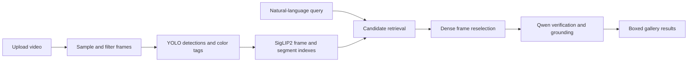

# Vision Guard

Vision Guard is a scan-first CCTV video search app with a Gradio interface. It indexes a video once, then retrieves and verifies frames for natural-language queries.

## Current flow



Indexing uses YOLO, SigLIP2, and the vector indexes. Query verification uses Qwen after candidates have been narrowed. Query-time gallery boxing reuses the verifier cache when the frame and query match.

## Features

- Scan-time frame sampling, duplicate filtering, object detection, and frame/segment indexing
- Detector-first retrieval for supported objects and vehicle colors
- Semantic retrieval for detailed natural-language phrases
- Dense frame reselection before verification
- Conservative Qwen visual verification with localized bounding boxes
- Grounded and clearly labeled detector-fallback boxed result images saved under each run's `segments/` directory
- No user-facing export controls or generated clips/reports

## Query behavior

Supported detector objects include `person`, `car`, `truck`, `bus`, `motorcycle`, `bicycle`, `umbrella`, `backpack`, `suitcase`, and `handbag`.

Vehicle-color queries support `yellow`, `white`, `black`, `gray`, `red`, `blue`, `green`, `orange`, and `brown`. Vehicle color is estimated from the centered 45% of the detected box to reduce road and shadow influence.

Detailed queries such as `person near a gate`, `yellow car entering`, or `blue truck` proceed through semantic retrieval and Qwen verification. A displayed verified result requires Qwen to confirm and localize the query. On Windows CPU development mode, the app returns clearly labeled low-confidence visual candidates because Qwen verification is unavailable. Gallery captions identify whether the box is grounded, a detector fallback, or not localized.

## Run locally

```bash
pip install -r requirements.txt
python app.py
```

Open `http://127.0.0.1:7860`.

The active Python environment must provide the packages in `requirements.txt`, including OpenCV, PyTorch, Ultralytics, Transformers, Decord, and Gradio. On Windows without CUDA, the verifier uses development passthrough mode and does not provide Qwen-grounded boxes; only labeled detector fallback boxes are available for supported object queries.

## Configuration

Operational settings are read from environment variables when the application starts. Invalid numeric values fall back to their safe defaults.

- `VISION_GUARD_OUTPUT_DIR`
- `VISION_GUARD_YOLO_MODEL`
- `VISION_GUARD_CLIP_MODEL`
- `VISION_GUARD_VERIFIER_MODEL`
- `VISION_GUARD_YOLO_CONF`
- `VISION_GUARD_YOLO_IMGSZ`
- `VISION_GUARD_INDEX_WORKERS`
- `VISION_GUARD_INDEX_BIT_WIDTH`
- `VISION_GUARD_SAMPLE_SEC`
- `VISION_GUARD_WINDOW_SEC`
- `VISION_GUARD_QUERY_TOP_K`
- `VISION_GUARD_GALLERY_COLUMNS`
- `VISION_GUARD_VERIFY_TIMEOUT_SEC`
- `VISION_GUARD_HOST`
- `GRADIO_SHARE`

## Runtime layout

- `app.py` - Gradio UI and scan/search event wiring
- `pipeline.py` - indexing, retrieval, reranking, verification, and boxed-image creation
- `segmenter.py` - query-grounding adapter with detector-box fallback
- `qwen_verifier.py` - visual verification, box cleaning, caching, and backend selection
- `tracker.py` - YOLO detection and tracking wrapper
- `vlm.py` - SigLIP2 image/text embeddings
- `vector_index.py` - frame and segment vector search
- `video_reader.py` - Decord/OpenCV video access
- `cache_utils.py` - model-cache configuration

## Run output

Each scan creates a timestamped directory under `output/` containing:

- `frames/` - sampled and reselected frame images
- `segments/` - boxed gallery-match images
- `reports/` - internal index artifacts (`frame_index.tvim`, `segment_index.tvim`, and `index.json`)

The internal index artifacts are not exposed as user downloads.

## Documentation

See [PROJECT_DOCUMENTATION.md](PROJECT_DOCUMENTATION.md) for architecture, retrieval behavior, constraints, and answered review questions.
